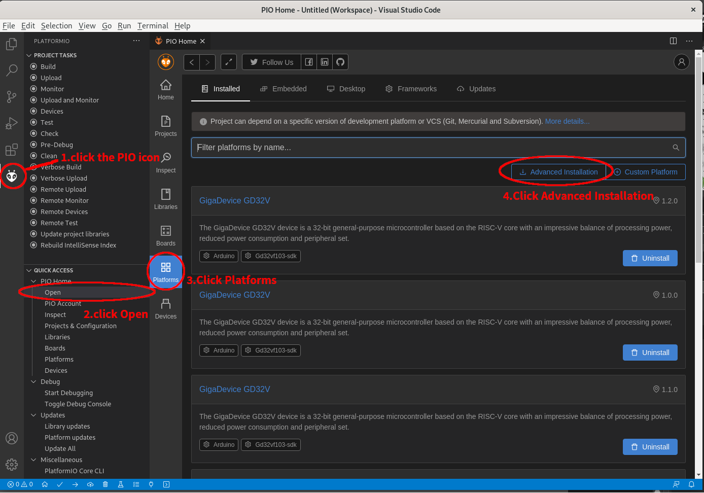
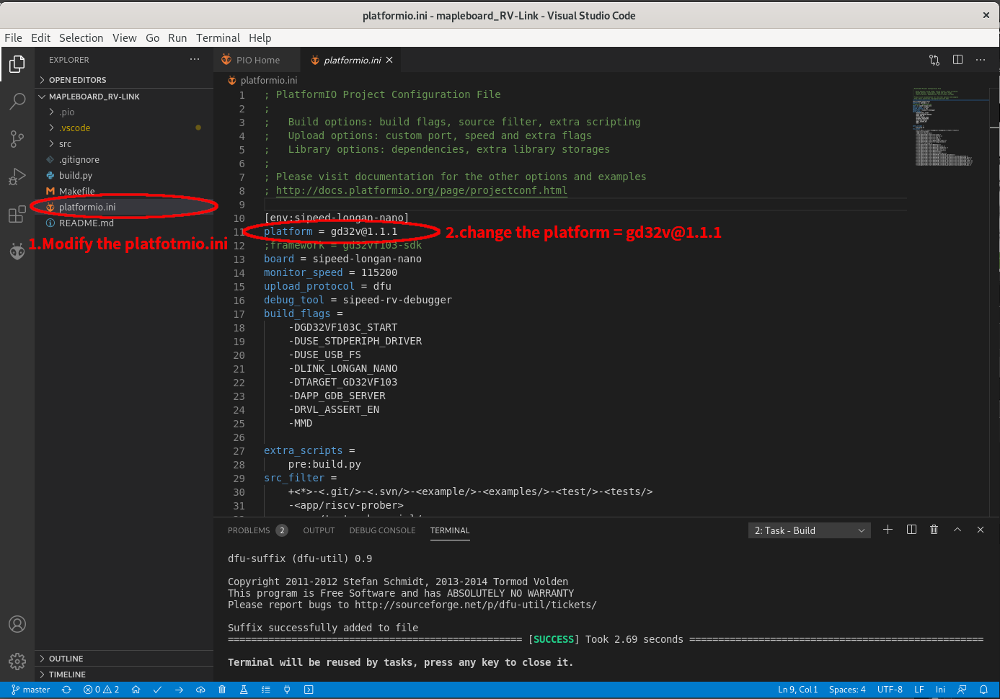
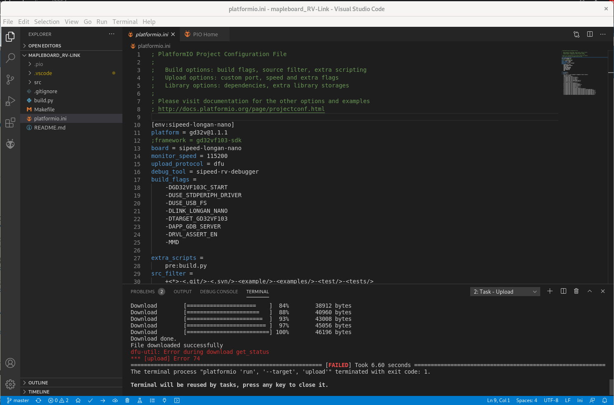
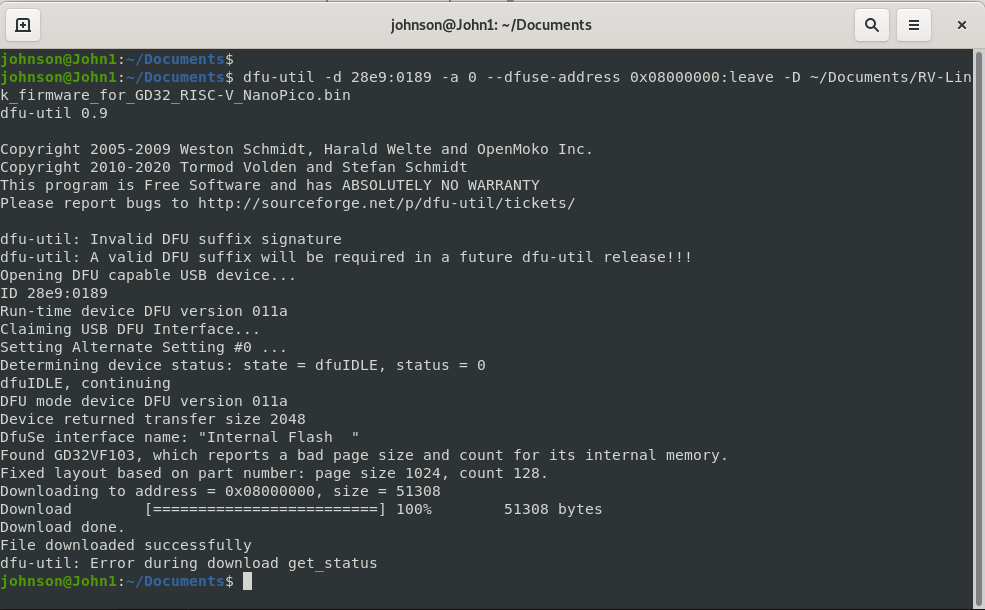
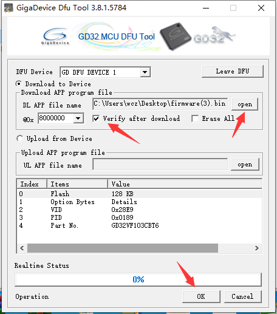

# RV-Link Introduction

RV-Link is a debugger which made up by RISC-V MCU GD32VF103CBT6

This repostory is a copy of <https://gitee.com/zoomdy/RV-LINK>.

If you want to download the code at the website, you'll need to register an account, so I copy the code and firmware to the github to avoid that, and let everyone can use easily.

As the name "RV-Link" implied, this project is like "BlackMagic", which can turn MCUs into JTAG device, like the J-Link, and this project use GD32VF103CBT6 RISC-V architecture micro processor to do the job.

You can buy a GD32VF103CBT6 develop board at [GD32 RISC-V Nano Board](https://stage.mapleboard.org/gd32-risc-v-nano-product-page/)  

Or you can also choose the smaller one at [GD32 RISC-V Pico Board](https://stage.mapleboard.org/gd32-risc-v-pico-product-page/)

RV-Link是一個使用GD32VF103 RISC-V架構微處理器的除錯計專案
如同RV-Link這個名子暗示的，它是一個有如"BlackMagic"一樣，能夠將特定微處理器變成符合JTAG規範的除錯器（Debugger），而這個專案使用GD32VF103CBT6作為核心來完成這個任務。  

你可以前往 [GD32 RISC-V Nano Board](https://stage.mapleboard.org/gd32-risc-v-nano-product-page/) 來購買GD32VF103CBT6開發板，  

或者也可以買到更小更便宜的[GD32 RISC-V Pico Board](https://stage.mapleboard.org/gd32-risc-v-pico-product-page/)

# How to use

To use this reposity, you will need a GD32VF103 seires board.
And there are two ways to use this repository,  

One is **Only upload prebuild firmware**  

Another is **Build firmware from source code**

If you only want to upload the prebuild firmware, follow the step [HERE](https://github.com/HabonRoof/RV-Link/blob/master/README.md#upload-firmware-to-gd32-risc-v-nanopico)

If you prefer to build the firmware from source code, keep reading this documentation.

To build the firmware form source, you will need:

* First, buy a GD32 RISC-V Nano/Pico. 

* Second, follow the guide below to construce the environment to build the source code. 

* Third, upload the code through DFU mode, and ensure the on-board green LED flash. 

* Fourth, the board turned into RV-Link, so you can connect to another target (such as another GD32 RISC-V Board or any development board), follow the JTAG pinout, and use debugger to start yout journy of embedded system!   

要使用這個資料庫，你會需要DS32VF103系列的開發板，同時有兩種方法可以使用這個資料庫：  

第一種是只上傳預先編譯好的二進制機器碼到開發板上，省去編譯與環境設定的麻煩  

第二種則是從原始碼開始建立整份韌體。  

選擇第一種的使用者可以參考下面連結步驟的說明[HERE](https://github.com/HabonRoof/RV-Link/blob/master/README.md#upload-firmware-to-gd32-risc-v-nanopico)  

選則第二種的使用者先繼續往下閱讀這份文件。  

要從頭編譯原始碼，首先你會需要以下設備：

* 首先購買一塊GD32 RISC-V Nano/Pico板。  

* 第二，依照下方指南來建立開發環境以便建置RV-Link的韌體。  

* 第三，利用DFU上傳韌體，並且確認板載的綠色LED會閃爍。  

* 第四，現在開發板已經化身為RV-Link，你可以將任意板子透過JTAG的腳位規範連接到RV-Link，利用這個除錯器開起嵌入式系統的開發之旅吧！  

---

# 1. Environment Setup

The GD32V development environment may be different depending on the OS of your PC.  
There are three common used operation system, **Linux**, **Windows**, and **OS X**.
Please make sure which OS you are using, and follow the guide to setup your development environment.  

GD32的開發環境會因為你使用的個人電腦作業系統的不同而有不同。
但是常見的三種作業系統：**Linux**, **Windows**, 以及 **OS X** 都有支援，請依照自己的作業系統選擇開發環境。

## 1.1 For Linux user:
Benefit from the spirit of open source of Linux, you can build the firmware by PlatformIO or RISC-V GNU toolchain.  

受益於Linux的開源精神，你可以使用PlatformIO或者RISC-V GNU 工具鍊來進行建置。

* [PlatformIO](https://platformio.org/?utm_source=github&utm_medium=core)  

* [RISC-V GNU toolchain](https://github.com/riscv/riscv-gnu-toolchain)

### 1.1.1 PlatformIO  

中文版教學連結：[GD32 RISC-V 開發板的PlatformIO開發環境建置](https://stage.mapleboard.org/platformio-environment-setup/)  

You need to install Visual Studio Code (VSCode) first.
Download the Microsoft original .deb packeage [HERE](https://code.visualstudio.com/)  

The PlatformIO has it's own atrical to tell you how to install their extension for Visual Studio Code (VSCode) [HERE](https://docs.platformio.org/en/latest/integration/ide/vscode.html#ide-vscode)  

Open your VSCode and platformIO, install GD32V platform 

Enter the following URL to get the newest platform configuration:
<pre><code>
https://github.com/sipeed/platform-gd32v.git
</code></pre>

After you done the whole process of installation of PlatformIO, then download this repository into a specificated directory.  

And open the RV-Link folder, change the code in platformio.ini, like the picture below:

Make sure the code in **platform.ini** below is specify the platform version is gd32v@1.1.1
platform = gd32v@1.1.1  

請確認platformio.ini檔案中的platform=gd32v@1.1.1

Then click the "V" of the button toolbar, and click "arrow symbol" to upload the firmware.
按下畫面下方的"V"來編譯原始碼，按下箭頭符號來上傳原始碼。

If the upload success, but the target board didn't work (the green LED didn't flash), it means the dfu-util is the old version(dfu-util -v shows the copyright end at 2016)  

Please extract the firmware file built by platform IO at "RV-Link/.pio/build/sipeed-longan-nano/firmware.bin",  
and upgrade the dfu-util to upload the .bin file to the GD32 RISC-V Nano/Pico correctlly.  
By following the Chapter 2

如果上傳成功，但是板子不會動作(閃爍綠色的板載LED燈)，那表示你的dfu-util是舊版本(可以輸入dfu-util -v 來確認版權是不是只有到2016)
請將編譯好的韌體檔案抓出來，路徑會是"RV-Link/.pio/build/sipeed-longan-nano/firmware.bin"，並且更新你的dfu-util來將.bin檔上傳道GD32 RISC-V Nano/Pico上。
請參考第二章的內容。

### 1.1.2 RISC-V GNU Toolchain

To build whole things from scratch without PlatformIO is a challange, but we have done this before, so just follow our step and enjoy the tast of success.

The RISC-V GNU toolchain can be download [HERE](https://github.com/riscv/riscv-gnu-toolchain) by RISC-V foundation.  

For more information about how to use the toolchain, you can reference our [Mpb-toolchain-Example](https://github.com/MapleBoard/Mpb-toolchain-Example)  

If you had insalled our mapleboard toolchain, and make sure the command is in your system path, then you can simply type
<pre><code>
make dfu
</code></pre>
to upload the RV-Link firmware into your GD32 RISC-V Nano/Pico

使用RISC-V GNU 工具鍊進行建置：
不使用PlatformIO進行軟體的建置是個挑戰，但我們已經替你們走過一次了，只需要照著我們的教學就可以完成不依賴外掛插件來完成嵌入式系統的開發！  

RISC-V工具鍊可以在RISC-V基金會的官方github [這裡](https://github.com/riscv/riscv-gnu-toolchain)進行下載  

有關更多工具鍊的使用方法可以參考我們的[Mpb-toolchain-Example](https://github.com/MapleBoard/Mpb-toolchain-Example)

若你已經安裝好我們的Mapleboard工具鍊，並且將指令加入到系統路徑中，那你只需要簡單的執行 make dfu
就可以將Rv-Link的韌體上傳到GD32 RISC-V Nano/Pico開發板上

## 1.2 For MS Windows User
Follow the Microsoft instruction of VSCode [HERE](https://code.visualstudio.com/docs/?dv=win32user)
And download the PlatformIO extenion as linux user.

微軟作業系統的使用者可以參考[VSCode安裝說明](https://code.visualstudio.com/docs/?dv=win32user)
而PlatformIO的安裝過程與linux相同。

## 1.3 For OS X User
Follow the Microsoft instruction of VSCode [HERE](https://code.visualstudio.com/docs/?dv=osx)
And download the PlatformIO extension as linux user.  

OS X系統的使用者可以參考[VSCode安裝說明](https://code.visualstudio.com/docs/?dv=osx)
而PlatformIO的安裝過程與linux相同。

---

# 2. Upload Firmware to GD32 RISC-V Nano/Pico  

## 2.1 For Linux user:  

Install the newest(2020-08-10) dfu-util to upload the firmware into your target board.  

The official source code is [HERE](https://sourceforge.net/p/dfu-util/dfu-util/ci/master/tree/), please follow the instruction of the README file of dfu-util.

Let the development board get into DFU Mode:
Continue press down the BOOT button, and single press RST button and release, then release the BOOT button.
You can see the LED and LCD are both stop working, the GD32 RISC-V Nano/Pico is get into dfu mode.

安裝最新版本(2020-08-10)的dfu-util工具來將韌體燒錄進開發板。
官方的原始碼可以在[這裡](https://sourceforge.net/p/dfu-util/dfu-util/ci/master/tree/)取得，請依照README檔案中的只是來完成安裝。

讓開發板進入DFU模式：
先按下BOOT鍵不放，接著按一下RST鍵後放開，在鬆開BOOT鍵，你將會看到板子上的LED和LCD停止工作，那就代表CPU入DFU模式。

After installed the dfu-util, and download RV-Link_firmware_for_GD32_RISC-V_NanoPico.bin  
Open the console and type:

安裝好最新的dfu-util後，在終端機視窗輸入：

<pre><code>
dfu-util -d 28e9:0189 -a 0 --dfuse-address 0x08000000:leave -D ~/Download/RV-Link_firmware_for_GD32_RISC-V_NanoPico.bin
</pre></code>

After the -D parameter,the firmware file path may be different depending on the user name.

在參數 -D 後方所接的韌體路徑名稱可能因為使用者不同而有所不同。

You can see the bin code download to the target successfully as the picture below:

你可以看到上傳成功的樣子如圖所示：

## 2.2 For Windows user:

1.  You need Zadig "libusb" driver for Windows (Not GD32 official driver), the download link is [HERE](https://github.com/pbatard/libwdi/releases/download/b721/zadig-2.4.exe)  
首先你需要安裝Zadig的USB驅動程式(非GD32)，可以在[這裡](https://github.com/pbatard/libwdi/releases/download/b721/zadig-2.4.exe)下載

2. After download, launch "Zadig", and choose "GD32 Devices in DFU Mode", replace the driver into "WinUSB"
安裝好之後，啟動Zadig，並選擇"GD32Devices in DFU Mode" 點選 replace the driver into "WinUSB"

3. Download DFU Tool for Windows

Download a DFU Tool for windows [HERE](http://dl.sipeed.com/LONGAN/Nano/Tools/GD32_MCU_Dfu_Tool_V3.8.1.5784_1.rar) and decompress it.  
You will get two directeries that is "GD32 MCU Dfu Drivers_v1.0.1.2316" and "GD32 MCU Dfu Tool_v3.8.1.5784"  
下載Windows專用的DFU Tool，[下載網址](http://dl.sipeed.com/LONGAN/Nano/Tools/GD32_MCU_Dfu_Tool_V3.8.1.5784_1.rar)下載後解壓縮，你會的到兩個資料夾分別是"GD32 MCU Dfu Drivers_v1.0.1.2316" 和 "GD32 MCU Dfu Tool_v3.8.1.5784"

* Get into the driver directory, install the GD32 MCU Dfu Driver
首先進入驅動程式的資料夾，安裝GD32的驅動程式

* Run the "GD32 MCU DFU Tool.exe", plug in the GD32 RISC-V Nano/Pico Board, and press down the "BOOT" button on the board, and single press "RST" button, then release the "BOOT" button. Now the program can identify the GD32V chip.
接著啟動"GD32 MCU DFU Tool.exe"，並將GD32 RISC-V Nano/Pico開發板進入DFU模式，這樣DFU tool就可以辨識出我們的晶片。

4. Upload the firmware (which file name extension is .bin), and setup the download address as 0x08000000, select "Verify after download" and click "OK" to download the formware file into GD32 RISC-V Nano/Pico.
上傳韌體檔案(.bin結尾)，並將起始位址設為0x08000000，勾選"Verify after download"並點擊"OK"來上傳韌體檔案到GD32 RISC-V Nano/Pico。

## 2.3 For OS X user:
Follow the PlatformIO tutorial [HERE](https://platformio.org/platformio-ide)  
And the other step is like as Linux tutorial.
依照PlatformIO的教學，其他步驟跟Linux一樣。
